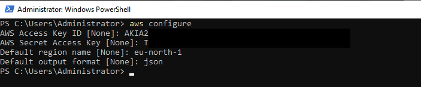
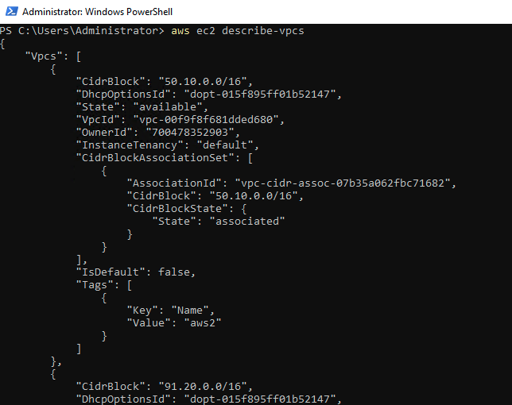

# AWS Cli

## Előfeltételek

Hozzunk létre egy IAM felhasználót, akihez tartozik egy Access Key és egy Secret Key. Ezeket a kulcsokat használjuk majd a CLI-hez.

**A felhasználónak a lehető legkisebb jogosultságot adjuk!** 

_A mi példánkban ettől eltérünk, mert a gyakorlatokhoz szükségünk lesz a legtöbb jogosultságra. (PowerUser)_

Ha a felhasználónk létrejött, akkor hozzunk létre hozzá egy kulcsot. Ennek menete:

1. Kattintsunk a felhasználóra. (IAM -> Users)
2. Kattintsunk a `Security credentials` fülre.
3. Kattintsunk a `Create access key` gombra.
4. Válasszuk a `Command Line Interface (CLI)` lehetőséget.
5. Pipáljuk ki a `I understand the above recommendation and want to proceed to create an access key.` opciót.
6. Kattintsunk a `Next` gombra majd a `Create access key` gombra.
7. Mentsük le biztonságos helyre a `Secret access key`-t (Ezt csak egyszer láthatjuk!) és a `Access key ID`-t.
    - Acces Key formátum: AKIAxxxxxxxxxxxxx
    - Secret Key formátum: xxxxxxxxxxxxxxxxxxxxxxxxxxxxxxxxxxxxxxxx


## Telepítés

### Windows

1. Töltsük le a legfrissebb MSI telepítőt az alábbi linkről: https://awscli.amazonaws.com/AWSCLIV2.msi
2. Telepítsük fel a telepítőt. (Next-Next-Finish)
3. Nyiss egy `cmd` vagy `powershell` ablakot.
4. Futtasd le a következő parancsot:

```powershell
aws --version
``` 

### MacOS

1. Töltsük le a legfrissebb telepítőt az alábbi linkről: https://awscli.amazonaws.com/AWSCLIV2.pkg
2. Telepítsük fel a telepítőt.
3. Nyiss egy `Terminal` ablakot és futtasd le a következő parancsot:

```bash
aws --verison
```


## Konfiguráció


1. Parancssorban futtassuk le a következő parancsot:

```bash
aws configure
```

2. Add meg az Access Key-t, a Secret Key-t, a default region-t és a default output formátumot.



_Ellenőrzés (Linux és MacOO): `cat ~/.aws/credentials` és `cat ~/.aws/config`_


_Megjegeyzés: Nincs szükség további bejelentkezésre._

## Használat

Példaként, kérdezzük le a virtuális hálózatokat:
    
```bash
aws ec2 describe-vpcs
```



