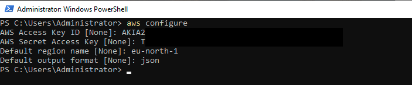
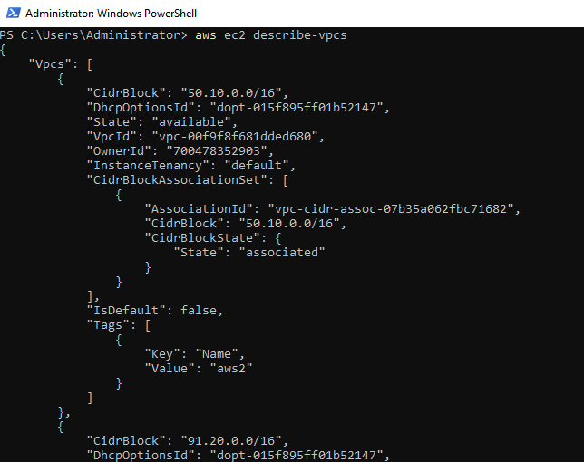

# AWS Cli

## Tartalomjegyzék

- [Előfeltételek](#elõfeltételek)
- [Telepítés](#telepítés)
  - [Windows](#windows)
  - [MacOS](#macos)
- [Konfiguráció](#konfiguráció)
- [Használat](#használat)
- [Hasznos AWS CLI parancsok](#hasznos-aws-cli-parancsok)
  - [EC2](#ec2)
  - [S3](#s3)
  - [IAM](#iam)
  - [CloudFront](#cloudfront)

## Előfeltételek

Hozzunk létre egy IAM felhasználót, akihez tartozik egy Access Key és egy Secret Key. Ezeket a kulcsokat használjuk majd a CLI-hez.

**A felhasználónak a lehető legkisebb jogosultságot adjuk!**

_A mi példánkban ettől eltérünk, mert a gyakorlatokhoz szükségünk lesz a legtöbb jogosultságra. (PowerUser)_

Ha a felhasználónk létrejött, akkor hozzunk létre hozzá egy kulcsot. Ennek menete:

1. Kattintsunk a felhasználóra. (IAM -> Users)
2. Kattintsunk a `Security credentials` fülre.
3. Kattintsunk a `Create access key` gombra.
4. Válasszuk a `Command Line Interface (CLI)` lehetőséget.
5. Pipáljuk ki a `I understand the above recommendation and want to proceed to create an access key.` opciót.
6. Kattintsunk a `Next` gombra majd a `Create access key` gombra.
7. Mentsük le biztonságos helyre a `Secret access key`-t (Ezt csak egyszer láthatjuk!) és a `Access key ID`-t.
   - Acces Key formátum: AKIAxxxxxxxxxxxxx
   - Secret Key formátum: xxxxxxxxxxxxxxxxxxxxxxxxxxxxxxxxxxxxxxxx

## Telepítés

### Windows

1. Töltsük le a legfrissebb MSI telepítőt az alábbi linkről: https://awscli.amazonaws.com/AWSCLIV2.msi
2. Telepítsük fel a telepítőt. (Next-Next-Finish)
3. Nyiss egy `cmd` vagy `powershell` ablakot.
4. Futtasd le a következő parancsot:

```powershell
aws --version
```

### MacOS

1. Töltsük le a legfrissebb telepítőt az alábbi linkről: https://awscli.amazonaws.com/AWSCLIV2.pkg
2. Telepítsük fel a telepítőt.
3. Nyiss egy `Terminal` ablakot és futtasd le a következő parancsot:

```bash
aws --verison
```

## Konfiguráció

1. Parancssorban futtassuk le a következő parancsot:

```bash
aws configure
```

2. Add meg az Access Key-t, a Secret Key-t, a default region-t és a default output formátumot.



_Ellenőrzés (Linux és MacOO): `cat ~/.aws/credentials` és `cat ~/.aws/config`_

_Megjegeyzés: Nincs szükség további bejelentkezésre._

## Használat

Példaként, kérdezzük le a virtuális hálózatokat:

```bash
aws ec2 describe-vpcs
```



## Hasznos AWS CLI parancsok

### EC2

```bash
# EC2 instance-ek listázása
aws ec2 describe-instances --query "Reservations[].Instances[].{ID:InstanceId,Name:Tags[?Key=='Name']|[0].Value,State:State.Name,Type:InstanceType,AZ:Placement.AvailabilityZone}" --output table

# Egy instance leállítása
aws ec2 stop-instances --instance-ids i-0123456789abcdef0

# Egy instance elindítása
aws ec2 start-instances --instance-ids i-0123456789abcdef0

# Egy instance állapotának ellenőrzése
aws ec2 describe-instances --instance-ids i-0123456789abcdef0 --query "Reservations[0].Instances[0].State.Name" --output text

# Security group-ek listázása
aws ec2 describe-security-groups --output table

# EC2 key pair-ek listázása
aws ec2 describe-key-pairs --output table

# SSH hozzáféréshez szükséges publikus IP lekérdezése
aws ec2 describe-instances --instance-ids i-0123456789abcdef0 --query "Reservations[0].Instances[0].PublicIpAddress" --output text
```

### S3

```bash
# Buckek listázása
aws s3 ls

# Egy bucket törzsének listázása
aws s3 ls s3://BUCKET_NEVE

# Fájl letöltése S3-ből
aws s3 cp s3://BUCKET_NEVE/index.html .

# Fájl feltöltése S3-be
aws s3 cp ./index.html s3://BUCKET_NEVE/index.html

# Mappa feltöltése S3-be
aws s3 cp ./website s3://BUCKET_NEVE/ --recursive

# Objektum törlése
aws s3 rm s3://BUCKET_NEVE/index.html

# Bucket létrehozása
aws s3 mb s3://BUCKET_NEVE --region eu-central-1

# Bucket eltávolítása (üres bucket esetén)
aws s3 rb s3://BUCKET_NEVE --force

# Bucket versioning státusz ellenőrzése
aws s3api get-bucket-versioning --bucket BUCKET_NEVE

# Bucket policy lekérdezése
aws s3api get-bucket-policy --bucket BUCKET_NEVE
```

### IAM

```bash
# Felhasználók listázása
aws iam list-users --output table

# Role-ok listázása
aws iam list-roles --output table

# Policy-k listázása
aws iam list-policies --scope AWS --output table

# Egy felhasználó adatainak lekérdezése
aws iam get-user --user-name dev-user

# Egy role részletei
aws iam get-role --role-name S3ReadOnlyRole

# Egy policy neve és ARN-ja
aws iam list-attached-role-policies --role-name S3ReadOnlyRole --output table

# Role hozzárendelése EC2 instance-hez
aws iam attach-role-policy --role-name S3ReadOnlyRole --policy-arn arn:aws:iam::aws:policy/AmazonS3ReadOnlyAccess

# Később ellenőrizhető: a Role ténylegesen csatolva van-e az instance-hez
aws iam list-attached-role-policies --role-name S3ReadOnlyRole
```

### CloudFront

```bash
# Distribution-ek listázása
aws cloudfront list-distributions --output table

# Egy distribution részletei
aws cloudfront get-distribution --id DISTRIBUTION_ID

# Distribution státusz ellenőrzése
aws cloudfront get-distribution --id DISTRIBUTION_ID --query "Distribution.Status" --output text

# Invalidation létrehozása (cache törlés)
aws cloudfront create-invalidation --distribution-id DISTRIBUTION_ID --paths "/*.html"

# Invalidation állapotának lekérdezése
aws cloudfront get-invalidation --distribution-id DISTRIBUTION_ID --id INVALIDATION_ID

# Alias / custom domain konfiguráció ellenőrzése
aws cloudfront get-distribution-config --id DISTRIBUTION_ID
```

### Gyakori hasznos parancsok a gyakorlathoz

```bash
# AWS account ID lekérdezése
aws sts get-caller-identity

# Region beállítása a CLI-ben
aws configure set region eu-central-1

# Aktuális AWS CLI konfiguráció megtekintése
aws configure list

# Egy konkrét bucket objektumok listázása
aws s3api list-objects-v2 --bucket BUCKET_NEVE --output table
```
