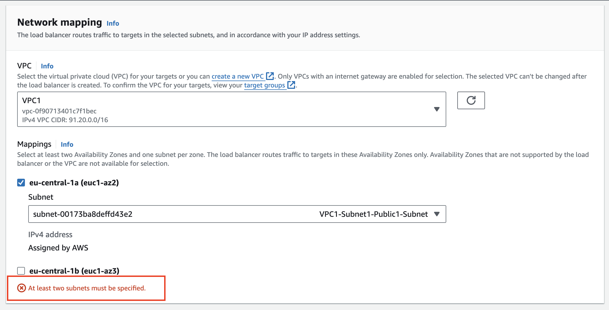
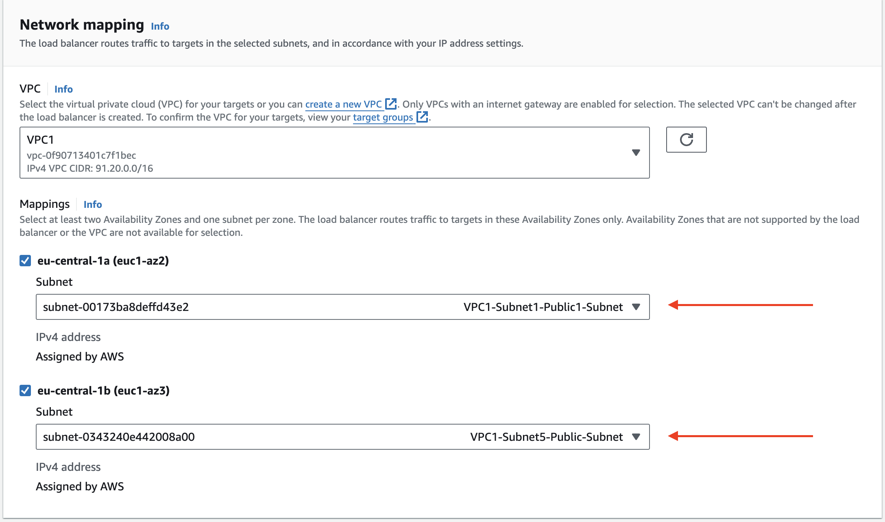

# Virtuális gépek (Compute)

## Tartalomjegyzék

- [EC2 instances (virtuális gépek)](#ec2-instances-virtuális-gépek)
  - [Linux szerver web kiszolgálóként](#linux-szerver-web-kiszolgálóként)
- [Elastic Beanstalk](#elastic-beanstalk)
  - [Beanstalk alkalmazás létrehozása](#beanstalk-alkalmazás-létrehozása)
  - [Beanstalk alkalmazás ellenőrzése](#beanstalk-alkalmazás-ellenőrzése)
  - [NodeJS alkalmazás GitHub-ról](#nodejs-alkalmazás-github-ról)
- [Terheléselosztó (Load Balancer) hibajavítás 1 db subnet esetén](#terheléselosztó-load-balancer)

## EC2 instances (virtuális gépek)

Néhány hasznos parancs, vagy segédlet.

### Egyedi képfájl létrehozása CloudShell-ből: https://github.com/cloudsteak/cloud-custom-images

### Linux szerver web kiszolgálóként

1. Nyissuk meg az EC2 dashboard-ot: https://eu-central-1.console.aws.amazon.com/ec2/home
2. Kattintsunk a [`Lunch instance`](https://eu-central-1.console.aws.amazon.com/ec2/home#LaunchInstanceWizard:) gombra
3. Name: AWS-Web
4. Amazom Machine Image: Amazon Linux
5. Instance type: t2.micro
6. Key pair name:
   - Ha van már létező kulcs párunk, akkor válasszuk azt
   - Ha még nincs, akkor kattintsunk a `Create new key pair` linkre
7. A `Network settings` részben pipáljuk be az `Allow HTTP traffic from internet` lehetőséget
8. `Advanced details` részt nyissuk le és görgessünk az oldal aljára
9. A `User data` mezőbe illeszkük bele az alábbi kódot:

```bash
#!/bin/bash
yum update -y
yum install -y httpd.x86_64
systemctl start httpd.service
systemctl enable httpd.service
echo "<html><head><style>body{font-family: Verdana, Geneva, Tahoma, sans-serif;background-image: url('https://github.com/cloudsteak/azurestaticwebsite/blob/main/assets/images/wallpaper-2024-07.jpg?raw=true');background-repeat: no-repeat;background-size: cover; background-position: center;color: white; text-align: center; padding-top: 1%;}</style></head><body><h1>Web:<br>$(hostname)</h1></body></html>" > /var/www/html/index.html
```

10. Végül kattintsunk a `Launch instance` gombra

11. Pár másodperc múlva el is készül a gép. Ha az alábbi üzenetet látjuk, kattintsunk az `i-**********` linkre

```html
Success Successfully initiated launch of instance (i-**********)
```

12. Várjuk meg, amíg a `Status check` mező értéke `2/2` értéket mutat
13. Kattintsunk a gép nevére (`AWS-Web`), majd a lap alján keressük meg a `Public IPv4 DNS` értékét. (`ec2-***-***-***-***.eu-central-1.compute.amazonaws.com`) Ezt másoljuk ki.
14. A kimásolt DNS nevet illeszük be egy új böngésző fülbe, az alábbi formátumban: `http://ec2-***-***-***-***.eu-central-1.compute.amazonaws.com`
15. Megnyílik a webszerverünk a szerver nevével.

## Elastic Beanstalk

Egy NodeJS alkalmazást fogunk CD folyamattal "telepíteni" Amazon ElasticBeanstalk-ra

Példa alkalmazás: https://github.com/cloudsteak/react-demo-n18

### Beanstalk alkalmazás létrehozása

1. Nyissuk meg a Beanstalk kezelő felületét: https://eu-central-1.console.aws.amazon.com/elasticbeanstalk/home
2. Katintsunk az [Create Application](https://eu-central-1.console.aws.amazon.com/elasticbeanstalk/home/create-environment) gombra
3. `Web server environment` gomb
4. Application name: NodeJS WebApp
5. `Environment name` maradhat, amit a konzol generál
6. `Platform` szekció:
   - Platform type: `Managed platform`
   - Platform: `Node.js`
   - Platform branch: `Node.js 18`
7. Application code: `Sample application`
8. Presets: `Single instance (free tier eligible)`
9. `Next`
10. Service role: `Create and use new service role`
11. EC2 Key pair:
    - Ha van már létező kulcs párunk, akkor válasszuk azt
    - Ha még nincs, akkor kattintsunk a `Create new key pair` linkre
12. `Next`
13. `Virtual Private Cloud (VPC)` részt nem módosítjuk
14. `Next`
15. `Configure instance traffic and scaling - optional` részt nem módosítjuk
16. `Next`
17. `Configure updates, monitoring, and logging - optional` részt nem módosítjuk
18. `Next`
19. `ReviewInfo` oldalon ellenőrizzük az eddig beállított értékeket
20. `Submit` gombra kattintva elindul a Beanstalk alkalmazásunk létrehozása

3-4 perc alatt el is készül az alkalmazásunk

### Beanstalk alkalmazás ellenőrzése

1. `Domain` felirat alatti linkre kattintva megnyílik az alkalmazásunk

### NodeJS alkalmazás GitHub-ról

1. Jelentkezzünk be a [GitHub](https://github.com) fiókunkba
2. AWS konzolon nyissuk meg a [CodePipeline](https://eu-central-1.console.aws.amazon.com/codesuite/codepipeline/pipelines) kezelőfelületét
3. [Create pipeline](https://eu-central-1.console.aws.amazon.com/codesuite/codepipeline/pipeline/new)
4. Pipeline name: `Beanstalk-WebApp-Pipeline`
5. Service role: `New service role`
6. `Next`
7. `Source` szekcióban, Sourve Provider: `GitHub (Version 2)`
8. `Connection`

   - Ha van létező kapcsolatunk, használjuk azt
   - Ha nincs létező kapcsolatunk, akkor kattintsunk a `Connect to GitHub` gombra

     8.1. Felugró ablakban adjuk meg a kapcsolat nevét a `Connection name` mezőben: `github.com`

     8.2. `GitHub Apps` esetén kattintsunk az `Install application` gombra

     8.3. Válasszuk a megfelelő GitHub organization-t. Majd az olal alján kattintsunk a `Save` gombra, hogy összekapcsoljuk az AWS-t és a GitHub-ot

     8.4. `Connect`

     8.5. Alábbi zöld hátterű üzenetet kell látnunk:

     ```html
     Ready to connect Your GitHub connection is ready for use.
     ```

9. `Repository name` mezőnál válasszuk azt ahol a kódunk található
10. Branch name: `main`
11. `Next`
12. `Build - optional` oldalon semmit sem változtatunk
13. `Skip build stage`, majd `Skip`
14. Deploy provider: `AWS Elactik Beanstalk`
15. `Region` értéke, ahol a Beanstalk alkalmazásunk található
16. Application name: `NodeJS WebApp`
17. Environment name: `NodeJSWebApp-env`
18. `Next`
19. `Review` oldalon ellenőrizzük az eddig beállított értékeket
20. `Create pipeline` gombra kattintva elindul a automatizáció létrehozása és az alkalmazás telepítése GitHub-ról
21. Ha az alábbi üzenete tlátjuk, minden rendben és alkalmazásunk már CD folyamattal települ a Beanstalk-ra:

```html
Success Congratulations! The pipeline Beanstalk-WebApp-Pipeline has been
created.
```

Két lépésbő áll a folyamatunk:

1. **Source**: GitHub kódban történt változáskor a változásokat észleli és azokat elkezdi felolvasni
2. **Deploy**: Lefordítja és telepíti az alkalmazást a Beanstalk köznyezetünkre

A folyamat interaktív és 3-4 perc után látható, hogy mindkét lépés `Succeeded` állapotú lesz. Ekkor a korábbi linkket frissítve a böngészónkben láthatjuk az alkalmazásunkat.

Ha a GitHub oldali kódban módosítunk valamit, akkor az pár perc után megjelenik az alkalmazásunkban.

## Terheléselosztó (Load Balancer)

Terheléselosztó létrehozása esetén nem elegendő 1 db subnet-et létrehozni, hanem legalább 2 db-ot kell. Ez a magasrendelkezésreállás (HA) érdekében szükséges.
Ha korábban [1 db publikus subnet-et hoztunk létre](network.md#subnet), akkor a következő hibaüzenettel fogunk szembesülni:
"At least two subnets must be specified."



Ez esetben hozzunk létre egy másik publikus subnet-et is. Ennek a lépései:

1. [Egy második publikus subnet létrehozása](network.md#5-vpc-1-második-publikus-subnet-subnet5---terheléselosztóhoz)
2. Majd elvégezzük a [subnet hozzárendelését](network.md#1-vpc1-publikus-route-table-routetable1) a Route Table-hoz
3. Ezután a [subnetet hozzárendeljük a NACL 1-hez](network.md#1-vpc1-nacl-public-subnet-nacl1) is.
4. Ezután folytatjuk a terheléselosztó létrehozását és a Network mapping résznél az alábbi subnet-eket választjuk ki:
   - VPC1-Subnet1-Public-Subnet
   - VPC1-Subnet5-Public-Subnet (terheléselosztóhoz)
     

Ekkor már a terheléselosztó létrehozása sikeres lesz.

_Megjegyzés: Gyakorláshoz az is megfeleő, ha ilynekor a második subnet-nek, a privát subnet-et választjuk ki. Ez természetesen nem lesz helyen konfiguráció, de a gyakorlás szempontjából megfelelő._
