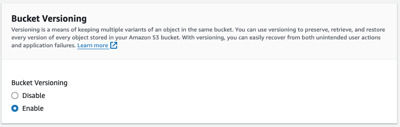
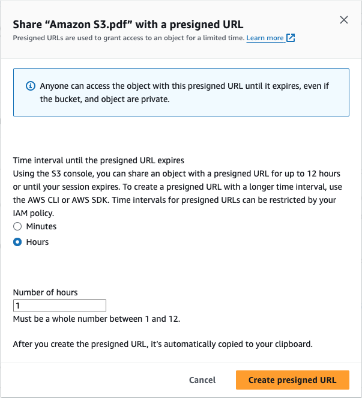

# Tárolás és fájlok (Storage)

## Tartalomjegyzék

- [S3](#s3)
  - [Fájlok tárolása nyilvánosan](#fájlok-tárolása-nyilvánosan)
  - [EC2 hozzáférés engedélyezése bucket-hez IAM role-al](#ec2-hozzáférés-engedélyezése-bucket-hez-iam-role-al)
  - [Verziókezelés](#verziókezelés)
  - [Fájl megosztása időkorlátozással](#fájl-megosztása-időkorlátozással)
  - [Statikus weboldal fájlok tárolására](#statikus-weboldal-fájlok-tárolására)

## S3

### Fájlok tárolása nyilvánosan

Vannak olyan helyzetek, hogy mindenki számára elérhető módon szeretnénk tárolni fájlokat. Erre egy példa.

1. Nyissuk meg az S3 felületét: https://s3.console.aws.amazon.com/s3/home
2. `Crete bucket`
3. Bucket name: `nyilvanos-fajlok`
4. `Block Public Access settings for this bucket` részben vegyük ki a pipát a `Block all public access` jelölőnégyzetből.
5. Fogadjuk egy az alatta lévő figyelmeztetést az `I acknowledge that the current settings might result in this bucket and the objects within becoming public` előtti jelölőnágyzet bepipálásával
6. Lap alján kattintsunk a `Create bucket` gombra és a tároló létrejön.
7. Lépjünk be a tárolóba és kattintsunk a `Permissions` fülre
8. A `Bucket policy` résznél kattintsunk az `Edit` gombra, majd illeszük be az alábbi JSON objektumot. (figyeljünk, hogy az `arn:aws:s3:::` rész után a bucket neve szerepeljen!)

```json
{
  "Version": "2012-10-17",
  "Statement": [
    {
      "Sid": "PublikusMinden",
      "Effect": "Allow",
      "Principal": "*",
      "Action": "s3:GetObject",
      "Resource": [
        "arn:aws:s3:::nyilvanos-fajlok/*",
        "arn:aws:s3:::nyilvanos-fajlok"
      ]
    }
  ]
}
```

9. Lap alján kattintsunk a `Save changes` gombra
10. Próbáljuk ki!
11. Menjünk az `Objects` fülre és töltsünk fel egy kép fájlt
12. Ha feltöltöttük a képet, akkor kattintsunk a nevére. Az új ablakban keressük meg az `Object URL` részt és másoljuk ki az értékét. Ezzel a linkkel bárki megnyithatja a képet.

### EC2 hozzáférés engedélyezése bucket-hez IAM role-al

Ha egy EC2 instance-nek a környező S3 buckethez szeretnénk hozzáférést adni, akkor nem kell hozzáférési kulcsot (access key) a VM-re tenni. A biztonságos megoldás az IAM role használata.

A működési elv:

- az EC2 instance egy IAM role-t kap meg
- a role rendelkezik az S3 buckethez szükséges engedélyekkel
- a virtuális gép a metadatszervizből automatikusan kapja az ideiglenes AWS hitelesítő adatokat
- az alkalmazás ezekkel dolgozik, anélkül hogy titkos kulcsok lennének a gépen

#### 1. Bucket létrehozása

1. Nyissuk meg az S3 konzolt: https://s3.console.aws.amazon.com/s3/home
2. Kattintsunk a `Create bucket` gombra
3. Adjunk nevet a tárolónak, például: `ec2-s3-read-bucket`
4. Kattintsunk a `Create bucket` gombra

#### 2. IAM role létrehozása

1. Nyissuk meg az IAM konzolt: https://console.aws.amazon.com/iam/
2. Menjünk a `Roles` menüpontra
3. Kattintsunk a `Create role` gombra
4. Válasszuk az `AWS service` kategóriát
5. Válasszuk az `EC2` szolgáltatást
6. Kattintsunk a `Next` gombra
7. Adjuk hozzá a role-hoz a szükséges policy-t

A legegyszerűbb mód a beépített `AmazonS3ReadOnlyAccess` policy használata, ha csak olvasási hozzáférés kell.

Ha saját szabályokat szeretnénk megadni, akkor az inline policy így nézhet ki:

```json
{
  "Version": "2012-10-17",
  "Statement": [
    {
      "Effect": "Allow",
      "Action": [
        "s3:GetObject",
        "s3:ListBucket"
      ],
      "Resource": [
        "arn:aws:s3:::ec2-s3-read-bucket",
        "arn:aws:s3:::ec2-s3-read-bucket/*"
      ]
    }
  ]
}
```

A role létrehozásakor a trust policy automatikusan tartalmazni fogja az EC2 szolgáltatást:

```json
{
  "Version": "2012-10-17",
  "Statement": [
    {
      "Effect": "Allow",
      "Principal": {
        "Service": "ec2.amazonaws.com"
      },
      "Action": "sts:AssumeRole"
    }
  ]
}
```

#### 3. Role hozzákapcsolása az EC2 instance-hez

1. Menjünk az EC2 felületre: https://console.aws.amazon.com/ec2/
2. Jelöljük ki a kívánt EC2 instance-et
3. Kattintsunk a `Actions` menüpontra
4. Válasszuk a `Security` → `Modify IAM role` lehetőséget
5. Válasszuk ki a korábban létrehozott role-t
6. Kattintsunk a `Save` gombra

Ezután az EC2 instance automatikusan kap ideiglenes AWS hitelesítő adatokat a role-ból.

#### 4. Bucket policy beállítása (ha szükséges)

Ha a bucketet a role által hozzáférhetővé akarjuk tenni, akkor a bucket `Permissions` → `Bucket policy` részén hozzáadhatunk egy engedélyt a role ARN-re.

Példa:

```json
{
  "Version": "2012-10-17",
  "Statement": [
    {
      "Sid": "AllowEC2RoleReadAccess",
      "Effect": "Allow",
      "Principal": {
        "AWS": "arn:aws:iam::<ACCOUNT_ID>:role/ec2-s3-read-role"
      },
      "Action": [
        "s3:GetObject",
        "s3:ListBucket"
      ],
      "Resource": [
        "arn:aws:s3:::ec2-s3-read-bucket",
        "arn:aws:s3:::ec2-s3-read-bucket/*"
      ]
    }
  ]
}
```

> Fontos: a `Principal` értékében a saját AWS account ID-jét és a role nevét kell megadni.

#### 5. Tesztelés az EC2-ből

Az EC2 instance-re SSH-val bejelentkezve ellenőrizhetjük, hogy működik-e az hozzáférés:

```bash
aws s3 ls s3://ec2-s3-read-bucket
aws s3 cp s3://ec2-s3-read-bucket/valami.txt ~/
```

Ha a role helyesen került hozzárendelésre, akkor a parancsok sikeresen lefutnak, és a felhasználó nem kell, hogy AWS access keyeket kezeljen a gépen.

Ez a legbiztonságosabb és ajánlott megoldás, ha az EC2 instance-nek S3 hozzáférést kell kapnia.

### Verziókezelés

Amikor szükségünk van egy vagy több fájlnak a korábbi verziójára, akkor hasznos lehet az S3 verziókezelése. Ezt a funkciót bekapcsolhatjuk egy már meglévő tárolónál is.

_Fontos:_

- _A verziókezelés bekapcsolása után a fájlok törlése nem jelenti azt, hogy azok véglegesen törlődnek. A fájlok törlése csak az aktuális verziót érinti._
- _Ha a verziókezelést egyszer bekapcsoltuk, azt később nem kapcsolhatjuk ki._

Új tároló létrehozásakor a `Create bucket` folyamat során a `Versioning` résznél kapcsolhatjuk be a verziókezelést.



Létező tároló esetén a következőképpen kapcsolhatjuk be:

1. Nyissuk meg az S3 felületét: https://s3.console.aws.amazon.com/s3/home
2. Kattintsunk a már meglévő tároló nevére
3. Kattintsunk a `Properties` fülre
4. A `Bucket Versioning` résznél kattintsunk az `Edit` gombra
5. Pipáljuk be a `Enable versioning` jelölőnégyzetet
6. Kattintsunk a `Save changes` gombra

**Verrziókezelés használata (példa fájlok)**

A verziókezelés bekapcsolása után a fájlok módosításakor az új verziók létrejönnek. Hogy Te is könnyedén ellenőrizhesd, találsz az [s3-version](./s3-version/Readme.md) mappában három verziót egy fájlhoz.

A különböző verziókat a következő módon érhetjük el:

1. Nyissuk meg az S3 felületét: https://s3.console.aws.amazon.com/s3/home
2. Kattintsunk a már meglévő tároló nevére
3. Kattintsunk a fájl nevére
4. A `Versions` fülön láthatjuk a verziókat

### Fájl megosztása időkorlátozással

Ha egy fájlt csak egy bizonyos időszakig szeretnénk elérhetővé tenni, akkor hasznos lehet az S3 által nyújtott időkorlátozás. Ennek neve `Pre-signed URL`.

Az alábbiakban egy példát láthatsz, hogyan hozhatsz létre egy 1 órás időkorlátozott linket egy fájlhoz.

1. Nyissuk meg az S3 felületét: https://s3.console.aws.amazon.com/s3/home
2. Kattintsunk a már meglévő tároló nevére
3. Kattintsunk a fájl nevére
4. A `Object actions` gombra kattintva válasszuk a `Share with a presigned URL` lehetőséget
5. A megjelenő ablakban állítsuk be az időkorlátot és kattintsunk a `Create presigned URL` gombra
6. Ekkor a megosztási link a vágólapra kerül, amit bárhova beilleszthetünk.




### Statikus weboldal fájlok tárolására

Az S3 alkalmas egyszerű statikus weboldalak kiszolgálására (HTML, CSS, JS). Ebben a példában a repóban található minta fájlokat fogjuk használni:

- `files/s3-index.html`
- `files/s3-error.html`

**1. S3 tároló létrehozása**

1. Nyissuk meg az S3 felületét: https://s3.console.aws.amazon.com/s3/home
2. Kattintsunk a `Create bucket` gombra
3. Bucket name: `statikus-weboldal` (vagy egyedi név)
4. `Block Public Access settings for this bucket` részben vegyük ki a pipát a `Block all public access` jelölőnégyzetből
5. Fogadjuk el a figyelmeztetést az `I acknowledge...` jelölőnégyzet bepipálásával
6. Kattintsunk a `Create bucket` gombra

**2. Fájlok feltöltése**

1. Lépjünk be a létrehozott bucket-be
2. Kattintsunk az `Upload` gombra
3. Töltsük fel a következő fájlokat:
   - `files/s3-index.html` (ezt nevezzük át `index.html`-re)
   - `files/s3-error.html` (ezt nevezzük át `error.html`-re)
4. Kattintsunk az `Upload` gombra

**3. Statikus weboldal hosztolás bekapcsolása**

1. A bucket-ben nyissuk meg a `Properties` fület
2. Görgessünk a `Static website hosting` részhez
3. Kattintsunk az `Edit` gombra
4. `Enable` kiválasztása
5. `Hosting type`: `Host a static website`
6. `Index document`: `index.html`
7. `Error document`: `error.html`
8. Kattintsunk a `Save changes` gombra

**4. Bucket policy beállítása nyilvános olvasásra**

1. Nyissuk meg a `Permissions` fület
2. A `Bucket policy` résznél kattintsunk az `Edit` gombra
3. Illesszük be az alábbi policy-t (a bucket nevet cseréljük ki a sajátunkra):

```json
{
  "Version": "2012-10-17",
  "Statement": [
    {
      "Sid": "PublicReadForStaticWebsite",
      "Effect": "Allow",
      "Principal": "*",
      "Action": "s3:GetObject",
      "Resource": "arn:aws:s3:::statikus-weboldal/*"
    }
  ]
}
```

4. Kattintsunk a `Save changes` gombra

**5. Tesztelés**

1. Menjünk vissza a `Properties` fülre
2. A `Static website hosting` résznél másoljuk ki a `Bucket website endpoint` URL-t
3. Nyissuk meg böngészőben: az `index.html` tartalma jelenik meg
4. Próbáljunk meg egy nem létező útvonalat (pl. `/nem-letezik`), ilyenkor az `error.html` oldal töltődik be

_Megjegyzés:_ S3 static website endpoint HTTP-alapú. HTTPS-hez tipikusan CloudFront + ACM tanúsítvány használata javasolt.

