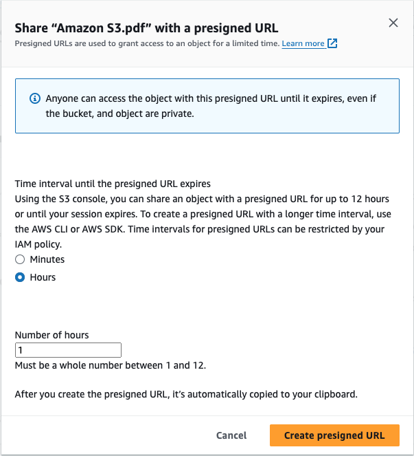

# Tárolás és fájlok (Storage)

## Tartalomjegyzék

- [S3](#s3)
  - [Fájlok tárolása nyilvánosan](#fájlok-tárolása-nyilvánosan)
  - [Verziókezelés](#verziókezelés)
  - [Fájl megosztása időkorlátozással](#fájl-megosztása-időkorlátozással)

## S3

### Fájlok tárolása nyilvánosan

Vannak olyan helyzetek, hogy mindenki számára elérhető módon szeretnénk tárolni fájlokat. Erre egy példa.

1. Nyissuk meg az S3 felületét: https://s3.console.aws.amazon.com/s3/home
2. `Crete bucket`
3. Bucket name: `nyilvanos-fajlok`
4. `Block Public Access settings for this bucket` részben vegyük ki a pipát a `Block all public access` jelölőnégyzetből.
5. Fogadjuk egy az alatta lévő figyelmeztetést az `I acknowledge that the current settings might result in this bucket and the objects within becoming public` előtti jelölőnágyzet bepipálásával
6. Lap alján kattintsunk a `Create bucket` gombra és a tároló létrejön.
7. Lépjünk be a tárolóba és kattintsunk a `Permissions` fülre
8. A `Bucket policy` résznél kattintsunk az `Edit` gombra, majd illeszük be az alábbi JSON objektumot. (figyeljünk, hogy az `arn:aws:s3:::` rész után a bucket neve szerepeljen!)

```json
{
  "Version": "2012-10-17",
  "Statement": [
    {
      "Sid": "PublikusMinden",
      "Effect": "Allow",
      "Principal": "*",
      "Action": "s3:GetObject",
      "Resource": [
        "arn:aws:s3:::nyilvanos-fajlok/*",
        "arn:aws:s3:::nyilvanos-fajlok"
      ]
    }
  ]
}
```

9. Lap alján kattintsunk a `Save changes` gombra
10. Próbáljuk ki!
11. Menjünk az `Objects` fülre és töltsünk fel egy kép fájlt
12. Ha feltöltöttük a képet, akkor kattintsunk a nevére. Az új ablakban keressük meg az `Object URL` részt és másoljuk ki az értékét. Ezzel a linkkel bárki megnyithatja a képet.

### Verziókezelés

Amikor szükségünk van egy vagy több fájlnak a korábbi verziójára, akkor hasznos lehet az S3 verziókezelése. Ezt a funkciót bekapcsolhatjuk egy már meglévő tárolónál is.

_Fontos:_

- _A verziókezelés bekapcsolása után a fájlok törlése nem jelenti azt, hogy azok véglegesen törlődnek. A fájlok törlése csak az aktuális verziót érinti._
- _Ha a verziókezelést egyszer bekapcsoltuk, azt később nem kapcsolhatjuk ki._

Új tároló létrehozásakor a `Create bucket` folyamat során a `Versioning` résznél kapcsolhatjuk be a verziókezelést.


Létező tároló esetén a következőképpen kapcsolhatjuk be:

1. Nyissuk meg az S3 felületét: https://s3.console.aws.amazon.com/s3/home
2. Kattintsunk a már meglévő tároló nevére
3. Kattintsunk a `Properties` fülre
4. A `Bucket Versioning` résznél kattintsunk az `Edit` gombra
5. Pipáljuk be a `Enable versioning` jelölőnégyzetet
6. Kattintsunk a `Save changes` gombra

**Verrziókezelés használata (példa fájlok)**

A verziókezelés bekapcsolása után a fájlok módosításakor az új verziók létrejönnek. Hogy Te is könnyedén ellenőrizhesd, találsz az [s3-version](./s3-version/Readme.md) mappában három verziót egy fájlhoz.

A különböző verziókat a következő módon érhetjük el:

1. Nyissuk meg az S3 felületét: https://s3.console.aws.amazon.com/s3/home
2. Kattintsunk a már meglévő tároló nevére
3. Kattintsunk a fájl nevére
4. A `Versions` fülön láthatjuk a verziókat

### Fájl megosztása időkorlátozással

Ha egy fájlt csak egy bizonyos időszakig szeretnénk elérhetővé tenni, akkor hasznos lehet az S3 által nyújtott időkorlátozás. Ennek neve `Pre-signed URL`.

Az alábbiakban egy példát láthatsz, hogyan hozhatsz létre egy 1 órás időkorlátozott linket egy fájlhoz.

1. Nyissuk meg az S3 felületét: https://s3.console.aws.amazon.com/s3/home
2. Kattintsunk a már meglévő tároló nevére
3. Kattintsunk a fájl nevére
4. A `Object actions` gombra kattintva válasszuk a `Share with a presigned URL` lehetőséget
5. A megjelenő ablakban állítsuk be az időkorlátot és kattintsunk a `Create presigned URL` gombra
6. Ekkor a megosztási link a vágólapra kerül, amit bárhova beilleszthetünk.


